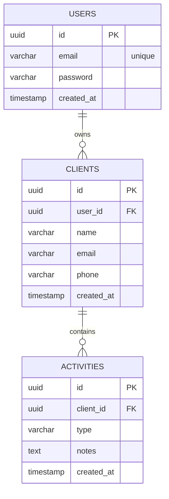

# ClientHub API

Production-style REST API built with Spring Boot that models a client relationship management system with transactional integrity, DTO separation, relational domain modeling, and structured error handling.

This project demonstrates backend architectural discipline beyond simple CRUD operations.

---

## Overview

The system manages:

- Users
- Clients
- Client Activities

It models a typical CRM workflow where authenticated users manage their own client relationships and track interactions.

Business rules enforced by the application include:

- Each client belongs to exactly one user
- Activities must be associated with an existing client
- Users can only access their own clients
- Activities are always attached to a client context

All rules are implemented inside transactional service boundaries.

---

## Architecture

This application follows a layered backend architecture.

### Controller Layer
Thin REST endpoints responsible only for HTTP concerns.

### Service Layer
Business rules, ownership validation, and transaction boundaries.

### Repository Layer
Spring Data JPA persistence abstraction.

### Domain Layer
Relational modeling with explicit entity relationships.

### DTO Layer
Prevents entity leakage and defines stable API contracts.

### Exception Layer
Centralized JSON error handling via `@ControllerAdvice`.

---

## Architectural Highlights

- Service-level transaction management using `@Transactional`
- Ownership enforcement between Users → Clients → Activities
- DTO-based API contracts to prevent entity exposure
- Explicit relational modeling with foreign keys
- Pagination support for scalable data retrieval
- Centralized error handling for consistent API responses
- Dockerized PostgreSQL for reproducible local development
- OpenAPI documentation via Swagger

---

## Data Model




Relationships enforce ownership boundaries:

```
User
  └── Clients
        └── Activities
```

This ensures users can only interact with data they own.

---

## Key Endpoints

### Create Client

```
POST /clients
```

### List Clients

```
GET /clients
```

### Get Client

```
GET /clients/{clientId}
```

### Delete Client

```
DELETE /clients/{clientId}
```

### Create Client Activity

```
POST /clients/{clientId}/activities
```

### List Client Activities

```
GET /clients/{clientId}/activities
```

---

## Example Client Response

```json
{
  "id": "6b0b0c75-3f6d-4f3c-8b39-33f5d40b4f21",
  "name": "John Doe",
  "email": "john@email.com",
  "phone": "555-1234",
  "createdAt": "2026-03-15T22:55:21Z"
}
```

---

## Error Handling

Standardized error format:

```json
{
  "timestamp": "2026-03-15T22:55:21Z",
  "status": 404,
  "error": "Not Found",
  "message": "Client not found",
  "path": "/clients/123"
}
```

Business exceptions are translated via global exception handling.

---

## Testing Strategy

### Integration Testing

* Real PostgreSQL via Testcontainers
* Full Spring context (`@SpringBootTest`)
* Repository and service validation
* Transaction boundary verification

### Controller Testing

* `@WebMvcTest`
* Service mocking
* HTTP contract verification

Run tests:

```
./mvnw clean test
```

Docker must be running.

---

## Running the Application

Start PostgreSQL:

```
docker compose up -d
```

Run the API:

```
./mvnw spring-boot:run
```

Application will start at:

```
http://localhost:8080
```

API documentation available at:

```
http://localhost:8080/swagger-ui.html
```

---

## Tech Stack

* Java 21
* Spring Boot 4
* Spring Web MVC
* Spring Data JPA
* Hibernate
* PostgreSQL
* Docker
* OpenAPI / Swagger
* Testcontainers
* JUnit 5
* Mockito
* Lombok

---

## What This Project Demonstrates

* Understanding of layered backend architecture
* Relational domain modeling
* Transactional service boundaries
* Clean API contract design with DTO separation
* Centralized error handling
* Containerized development environments
* Real database integration testing

---

## Future Enhancements

* JWT authentication and authorization
* User registration and login endpoints
* Ownership enforcement via security context
* API pagination and filtering improvements
* CI/CD pipeline integration
* Observability (logging and metrics)


