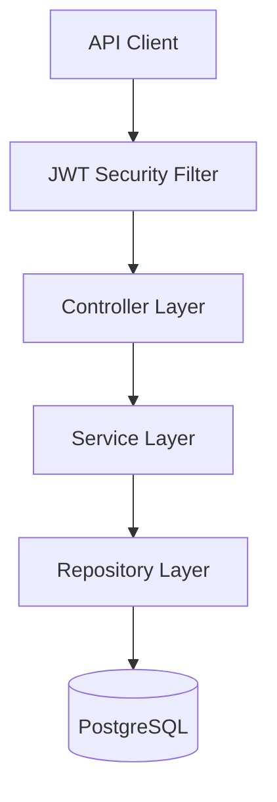
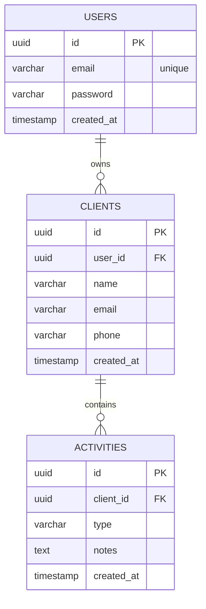
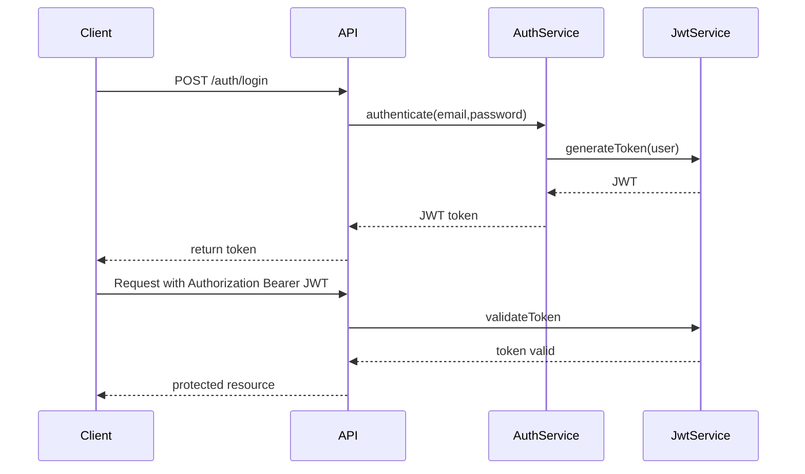
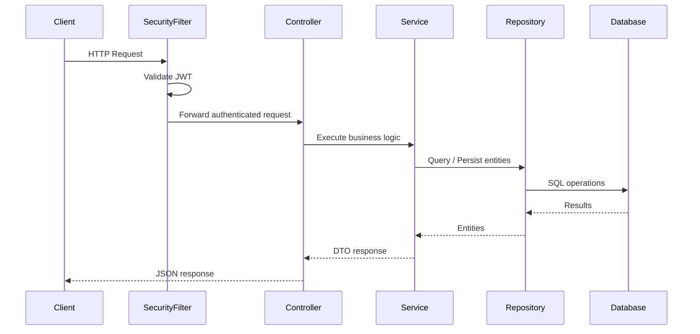

<<<<<<< HEAD
# ClientHub API

## ClientHub is under active development, with ongoing enhancements, bug tracking, and feature planning managed through GitHub Projects. ##

Production-style REST API built with Spring Boot that models a client relationship management system with transactional integrity, DTO separation, relational domain modeling, and structured error handling.

This project demonstrates backend architectural discipline beyond simple CRUD operations.

---

# Overview

The system manages:

- Users
- Clients
- Client Activities

It models a typical CRM workflow where authenticated users manage their own client relationships and track interactions.

Business rules enforced by the application include:

- Each client belongs to exactly one user
- Activities must be associated with an existing client
- Users can only access their own clients
- Activities are always attached to a client context
- Authentication is enforced via JWT tokens

All rules are implemented inside transactional service boundaries.

---

## Tech Stack
- Java 21
- Spring Boot
- Spring Web MVC
- Spring Data JPA
- Spring Security
- Hibernate
- PostgreSQL
- Docker
- OpenAPI / Swagger
- Lombok
- JWT

---

## What This Project Demonstrates
- Understanding of layered backend architecture
- Relational domain modeling
- Transactional service boundaries
- Secure authentication with JWT
- Multi-tenant ownership enforcement
- Clean API contract design with DTO separation
- Centralized error handling
- Containerized development environments

---

## Why This Project Exists

The goal of ClientHub is to demonstrate the design and implementation of a production-style backend system rather than a simple CRUD demo.

The project emphasizes:
- layered architecture
- relational domain modeling
- secure authentication
- ownership enforcement
- maintainable API design
- reproducible local environments

---

# Architecture

This application follows a layered backend architecture.

### Controller Layer
Thin REST endpoints responsible only for HTTP concerns.

### Service Layer
Business rules, ownership validation, and transaction boundaries.

### Repository Layer
Spring Data JPA persistence abstraction.

### Domain Layer
Relational modeling with explicit entity relationships.

### DTO Layer
Prevents entity leakage and defines stable API contracts.

### Exception Layer
Centralized JSON error handling via `@ControllerAdvice`.

### Security Layer
JWT authentication and request filtering using Spring Security.

---

## Architectural Highlights

- JWT authentication with stateless security
- Service-level transaction management using `@Transactional`
- Ownership enforcement between Users → Clients → Activities
- DTO-based API contracts to prevent entity exposure
- Explicit relational modeling with foreign keys
- Pagination support for scalable data retrieval
- Centralized error handling for consistent API responses
- Dockerized PostgreSQL for reproducible local development
- OpenAPI documentation via Swagger

---

## System Architecture Diagram


This illustrates the request flow through the application layers.

⸻

##  Data Model


Relationships enforce ownership boundaries:

User
  └── Clients
        └── Activities

This ensures users can only interact with data they own.

---

## Authentication

Authentication is implemented using JWT tokens.

Login

```http request
POST /auth/login
```

Example request:
```json
{
  "email": "admin@clienthub.com",
  "password": "password"
}
```

Example response:
```json
{
  "token": "JWT_TOKEN"
}
```

Authenticated requests must include the token:

```jwt
Authorization: Bearer JWT_TOKEN
```

The authenticated user is resolved from the JWT and used to scope data access.

---

## JWT Authentication Flow


This flow demonstrates how the API authenticates users and secures protected endpoints.

---

## Request Lifecycle



This represents the internal lifecycle of an authenticated request.

---

## Key Endpoints

Login
```http request
POST /auth/login
```

---

Create Client
```http request
POST /clients
```

---

List Clients
```http request
GET /clients
```

Returns only clients owned by the authenticated user.

---

Get Client
```http request
GET /clients/{clientId}
```

Ownership validation ensures users cannot access another user’s clients.

---

Delete Client
```http request
DELETE /clients/{clientId}
```

---

Create Activity
```http request
POST /activities
```

Creates an activity attached to a client.

---

List Activities
```http request
GET /activities
```

---

Example Client Response
```json
{
  "id": "6b0b0c75-3f6d-4f3c-8b39-33f5d40b4f21",
  "name": "John Doe",
  "email": "john@email.com",
  "phone": "555-1234",
  "createdAt": "2026-03-15T22:55:21Z"
}
```

---

## Error Handling

Standardized error format:
```json
{
  "timestamp": "2026-03-15T22:55:21Z",
  "status": 404,
  "error": "Not Found",
  "message": "Client not found",
  "path": "/clients/123"
}
```

Business exceptions are translated via global exception handling.

---

## Pagination

Client listing endpoints support pagination.

Example:
```http request
GET /clients?page=0&size=20
```

Example response structure:
```json
{
	"content": [],
	"page": {
		"size": 20,
		"number": 0,
		"totalElements": 1,
		"totalPages": 1
	}
}
```

---

Running the Application

Start PostgreSQL:
```bash
docker compose up -d
```

Run the API:
```bash
./mvnw spring-boot:run
```

Application will start at:

http://localhost:8080

API documentation available at:

http://localhost:8080/swagger-ui.html

---

## Design Decisions

### DTO Separation

Entities are not exposed directly through the API.
Instead, request and response DTOs define the API contract.

Reasons:
	•	Prevents accidental entity exposure
	•	Allows API evolution independent of persistence models
	•	Avoids lazy-loading serialization problems
	•	Provides clear boundaries between persistence and API layers

Example:

Client Entity → ClientResponse DTO


---

### Service Layer Transactions

Business logic is contained inside service classes and annotated with @Transactional.

Reasons:
	•	Guarantees atomic operations for multi-step database interactions
	•	Centralizes business rules outside of controllers
	•	Prevents partial writes during failures
	•	Provides a clean separation between HTTP and domain logic

---

### Ownership Enforcement

Clients are scoped to authenticated users.

Rather than trusting client-provided identifiers, the application resolves the authenticated user from the SecurityContext and enforces ownership checks at the service layer.

This prevents:
	•	Cross-user data access
	•	IDOR (Insecure Direct Object Reference) vulnerabilities

---

### Stateless Authentication

Authentication uses JWT tokens rather than session-based authentication.

Reasons:
	•	Enables horizontal scalability
	•	Removes server-side session storage
	•	Allows stateless API deployments
	•	Simplifies integration with frontend clients

---

### Pagination by Default

Collection endpoints return paginated results using Spring Data Pageable.

Reasons:
	•	Prevents large dataset responses
	•	Allows efficient database querying
	•	Supports scalable API consumption

---

## Future Enhancements
- Integration tests with Testcontainers
- User registration endpoint
- Role-based authorization
- Nested activity endpoints (/clients/{id}/activities)
- API filtering and search 
- CI/CD pipeline integration
- Observability (logging and metrics)

--- 


=======
<strong>**DO NOT DISTRIBUTE OR PUBLICLY POST SOLUTIONS TO THESE LABS. MAKE ALL FORKS OF THIS REPOSITORY WITH SOLUTION CODE PRIVATE. PLEASE REFER TO THE STUDENT CODE OF CONDUCT AND ETHICAL EXPECTATIONS FOR COLLEGE OF INFORMATION TECHNOLOGY STUDENTS FOR SPECIFICS. **</strong>

# WESTERN GOVERNORS UNIVERSITY 
## D424 – SOFTWARE ENGINEERING CAPSTONE
Welcome to Software Engineering Capstone! This is an opportunity for students to develop full stack software engineering documentation and applications. They will execute documentation, unit testing, revision of software applications, and deploy software applications with scripts and containers on a cloud platform.

FOR SPECIFIC TASK INSTRUCTIONS AND REQUIREMENTS FOR THIS ASSESSMENT, PLEASE REFER TO THE COURSE PAGE.
BASIC INSTRUCTIONS
For this assessment, you will deploy your developed full stack software product to a web service of your choice.


## SUPPLEMENTAL RESOURCES  
1.	How to clone a project to IntelliJ using Git?

> Ensure that you have Git installed on your system and that IntelliJ is installed using [Toolbox](https://www.jetbrains.com/toolbox-app/). Make sure that you are using version 2022.3.2. Once this has been confirmed, click the clone button and use the 'IntelliJ IDEA (HTTPS)' button. This will open IntelliJ with a prompt to clone the proejct. Save it in a safe location for the directory and press clone. IntelliJ will prompt you for your credentials. Enter in your WGU Credentials and the project will be cloned onto your local machine.  

2. How to create a branch and start Development?

- GitLab method
> Press the '+' button located near your branch name. In the dropdown list, press the 'New branch' button. This will allow you to create a name for your branch. Once the branch has been named, you can select 'Create Branch' to push the branch to your repository.

- IntelliJ method
> In IntelliJ, Go to the 'Git' button on the top toolbar. Select the new branch option and create a name for the branch. Make sure checkout branch is selected and press create. You can now add a commit message and push the new branch to the local repo.

## SUPPORT
If you need additional support, please navigate to the course page and reach out to your course instructor.

## FUTURE USE
Take this opportunity to create or add to a simple resume portfolio to highlight and showcase your work for future use in career search, experience, and education!
>>>>>>> 9fc6ffc41125bf066f7232b04d25e70e3dbb67ad
